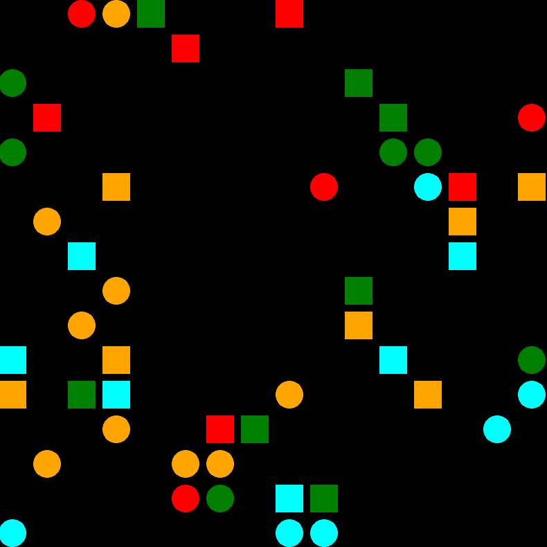
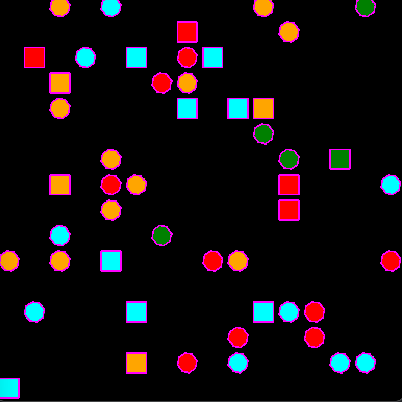
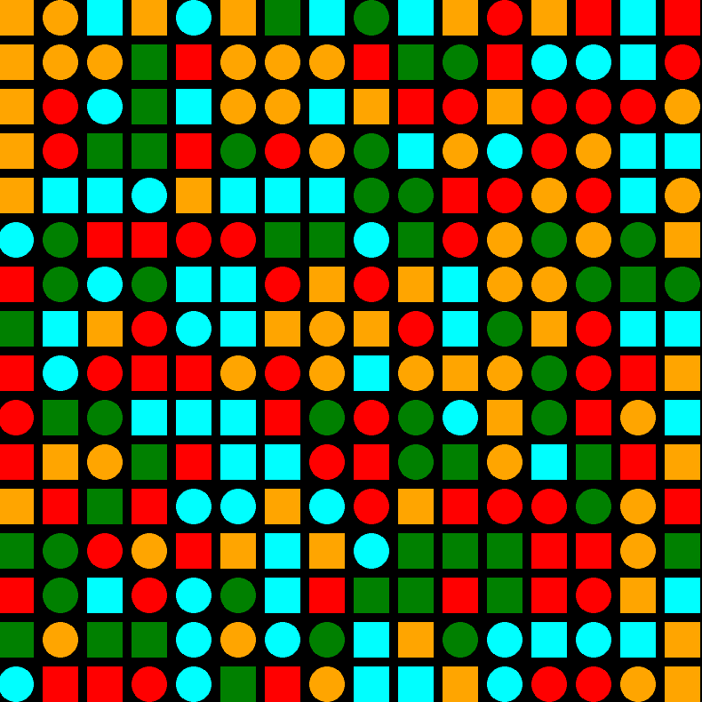
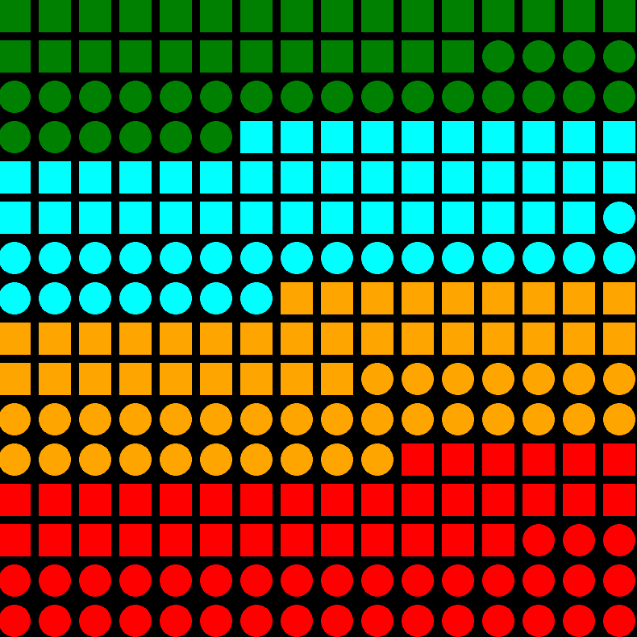

Kandidatnr: 10034

# Automatic shape sorting in ThreePP

This is a demo showcasing the use of OpenCV in conjunction with ThreePP.
The main goal of the project is to achieve scene generation in ThreePP and then use OpenCV to recognize and move objects within the scene.

The process is quite simple. First, a scene is generated using ThreePP. 
Then, OpenCV is used to obtain the coordinates, colors, and shapes of the objects. 
Once these details are identified, a raycaster is used to find specific "meshes" in the scene based on the coordinates provided by OpenCV.

After each detected object is linked to a mesh, the process of moving the objects can begin.



## How to build?

The project uses cmake fetch content and vcpkg to manage dependencies.
You'll have to specify the path to your vcpkg in the configuration for cmake:

```
-DCMAKE_TOOLCHAIN_FILE=[path to vcpkg]/scripts/buildsystems/vcpkg.cmake
```

If you use MinGW, you'll also have to add these lines into your cmake config:

```
-DVCPKG_TARGET_TRIPLET=x64-mingw-[DYNAMIC|STATIC] # Choose either static OR dynamic
-DVCPKG_HOST_TRIPLET=x64-mingw-[DYNAMIC|STATIC]   # Only needed if MSVC cant be found
```

## Controls

- **SPACE** - Sort the scene
- **R** - Generate a new scene
- **TAB** - Opens OpenCV preview window
- **X** - Hold to see contour detection (preview window must be open)
- **ENTER** - DLC
- **ESC** - Exit

## Media

[comment]: <> (GPT helped me with the html. I couldn't use the markdown format becuase the images became to big.)

<div style="display: flex; justify-content: space-around; align-items: center;">
  <div style="text-align: center; margin: 10px;">
    
    <p>Detection preview</p>
  </div>

  <div style="text-align: center; margin: 10px;">
    
    <p>Big scene</p>
  </div>

  <div style="text-align: center; margin: 10px;">
    
    <p>Big scene sorted</p>
  </div>
</div>


